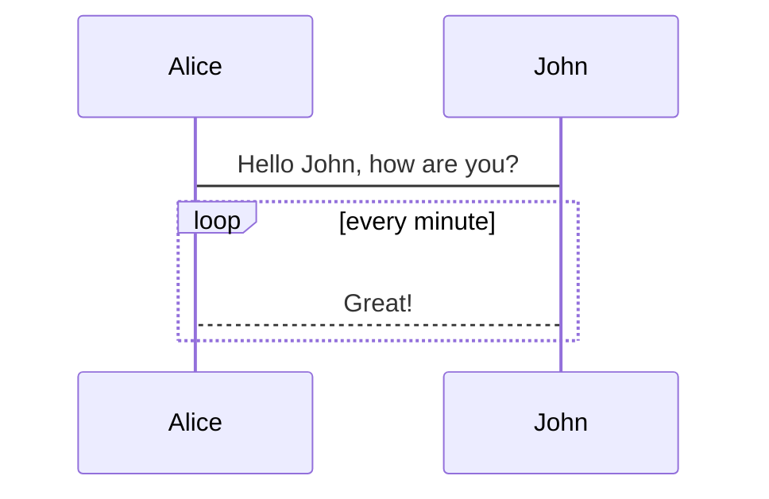

# 面试官问 Spring 原理怎么回答？

Spring 是一个全面的、企业应用开发一站式的解决方案，贯穿表现层、业务层、持久层，
同时 Spring 仍然可以和其他的框架无缝整合。

<!-- more -->

Spring 是一个久经考验的框架，毫无疑问是个非常优秀的框架。

```mermaid
sequenceDiagram
Alice->John: Hello John, how are you?
loop every minute
    John-->Alice: Great!
end
```

越挣扎越快乐
