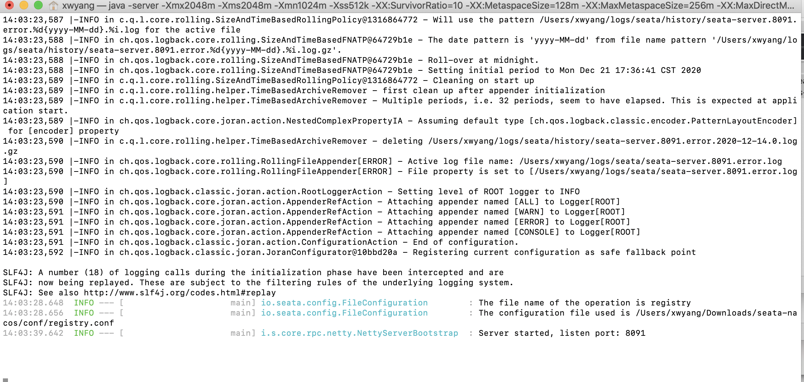
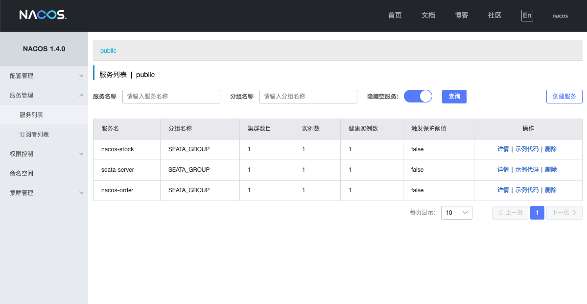
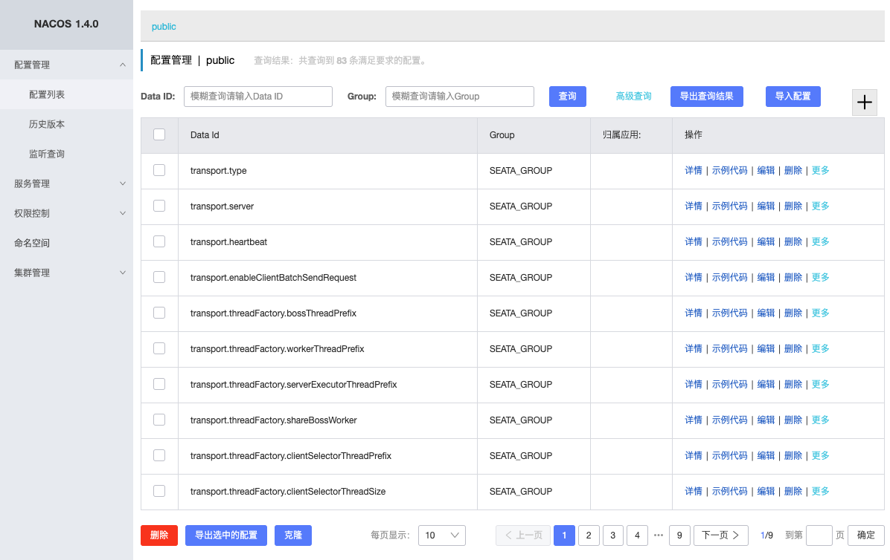

# Seata实践一（nacos）

本文介绍基于 SpringCloud、Mybatis-Plus、Nacos 集成 Seata 1.4.x 的简单示例。

<!-- more -->

## 准备工作
- 1、Nacos 下载和对应文档地址在此 [Nacaos文档](https://nacos.io/zh-cn/docs/quick-start.html) 。
- 2、Seata 下载地址 [https://github.com/seata/seata/](https://github.com/seata/seata/) 。
- 建库：
    - seata：包含 global_table、branch_table、lock_table
    - seata-order：包含 undo-log、tb-order
    - seata-stock：包含 undo-log、tb-stock
    
  `tb-*表自行创建，其他表可在上述seata官方地址找到建表脚本`

## 说在前面
- Seata目前在快速迭代，版本比较多，差别也挺大。一定要注意版本匹配问题；
- 如果使用的是 spring-cloud-alibaba-seata 依赖，则不需要手动传递xid，否则需要在微服务间自行传递xid，不传的表现为：
    - 1、A服务中方法a调用B服务中的方法b
    - 2、A服务中方法a调用C服务中的方法c
    - 3、若方法c发生异常，则方法c因为异常中断，方法a的db操作会回滚，方法b的db操作正常提交
- 每个独立库中的 **undo-log** 表，在方法开始前会插入对应记录，在事务完成提交或者回滚操作后记录会被删除，可通过方法断点的方式看到表记录；

## Nacos服务

下载Nacos完整包解压到本地后，不做任何修改，执行 `sh startup.sh -m standalone` 或 `bash startup.sh -m standalone` 启动即可；访问 http://localhost:8848/nacos/index.html
 可登陆查看服务注册详情。
 
默认用户名密码 nacos/nacos

## seata服务

### 配置 seata

解压下载的 seata-server-1.4.0.zip ，修改 conf 目录下的 registry.conf 文件如下（注册中心和配置中心都使用 nacos，用不到 file.conf 文件）：

```properties
registry {
  # file 、nacos 、eureka、redis、zk、consul、etcd3、sofa
  type = "nacos"
  loadBalance = "RandomLoadBalance"
  loadBalanceVirtualNodes = 10
  
  nacos {	 
	  application = "seata-server"
	  serverAddr = "localhost"
	  group = "SEATA_GROUP"
	  namespace = ""
	  cluster = "default"
	  username = "nacos"
	password = "nacos"
    }
}

config {
  type = "nacos"
 
  nacos {
    serverAddr = "localhost"
    namespace = ""
    group = "SEATA_GROUP"
    username = "nacos"
    password = "nacos"
  }
  
}

```
`注意：如果有修改过nacos配置，做上述配置要做对应的修改。上述配置已删除无关信息。`

### 注册 nacos

seata 源码中有个脚本文件夹 script ，里面包含 客户端、服务端、注册中心的各种配置模板。在 config-center 中找到 config.txt 修改对应配置。主要包含：
- 第15行 `service.vgroupMapping.my_test_tx_group=default` 中的 `my_test_tx_group` 改为你自定义的事务组，注意该分组需要和 application.yml中的配置一致；
- 第34行 `store.mode=file` 将 file 改为 db
- 第41~53行 修改 seata 数据库链接信息

然后执行 `sh nacos-config.sh -h ` 将配置写入 nacos 。

### 启动 seata

上述工作准备完毕 通过命令 `sh seata-server.sh` 启动 seata，如能看到如下日志则代表seata启动成功：

 
 
 接下来就可以准备创建项目来测试 seata 的分布式事务功能了。

## 创建工程

### 目录结构

本文以 nacos 为注册中心和配置中心，所以对应项目放在 nacos 目录下：

```
   |--seata-study
   
   |----nacos
   
   |------nacos-order
   
   |------nacos-stock
 ```

### pom依赖

以 nacos-order为例，nacos-stock核心内容没有区别。

```xml
    <properties>
        <project.build.sourceEncoding>UTF-8</project.build.sourceEncoding>
        <project.reporting.outputEncoding>UTF-8</project.reporting.outputEncoding>
        <java.version>1.8</java.version>
        <spring-cloud.version>Hoxton.SR9</spring-cloud.version>
        <seata.version>1.4.0</seata.version>
    </properties>


    <dependencies>
        <dependency>
            <groupId>org.springframework.boot</groupId>
            <artifactId>spring-boot-starter-web</artifactId>
        </dependency>

        <dependency>
            <groupId>org.projectlombok</groupId>
            <artifactId>lombok</artifactId>
            <optional>true</optional>
        </dependency>
        <dependency>
            <groupId>org.springframework.boot</groupId>
            <artifactId>spring-boot-starter-test</artifactId>
            <scope>test</scope>
        </dependency>


        <dependency>
            <groupId>org.springframework.cloud</groupId>
            <artifactId>spring-cloud-starter-openfeign</artifactId>
            <version>2.2.0.RELEASE</version>
        </dependency>


         <!-- nacos-->
        <dependency>
            <groupId>com.alibaba.cloud</groupId>
            <artifactId>spring-cloud-starter-alibaba-nacos-discovery</artifactId>
            <version>2.2.0.RELEASE</version>
        </dependency>

        <!--seata相关 开始-->
        <dependency>
            <groupId>com.alibaba.cloud</groupId>
            <artifactId>spring-cloud-alibaba-seata</artifactId>
            <version>2.2.0.RELEASE</version>
            <exclusions>
                <exclusion>
                    <groupId>io.seata</groupId>
                    <artifactId>seata-spring-boot-starter</artifactId>
                </exclusion>
                <exclusion>
                    <groupId>io.seata</groupId>
                    <artifactId>seata-all</artifactId>
                </exclusion>
            </exclusions>
        </dependency>

        <dependency>
            <groupId>io.seata</groupId>
            <artifactId>seata-spring-boot-starter</artifactId>
            <version>${seata.version}</version>
        </dependency>

        <!--seata相关 结束-->

        <dependency>
            <groupId>com.alibaba</groupId>
            <artifactId>druid-spring-boot-starter</artifactId>
            <version>1.2.3</version>
        </dependency>

        <dependency>
            <groupId>mysql</groupId>
            <artifactId>mysql-connector-java</artifactId>
            <version>5.1.48</version>
        </dependency>

        <dependency>
            <groupId>com.baomidou</groupId>
            <artifactId>mybatis-plus-boot-starter</artifactId>
            <version>3.4.1</version>
        </dependency>

    </dependencies>

```

### 项目配置
同样以 nacos-order 为例，nacos-stock修改对应数据库参数、server端口、应用名即可。application.yml完整内容如下：

```yaml
server:
  port: 30001

spring:
  application:
    name: nacos-order
  datasource:
    druid:
      filters: stat
      driver-class-name: com.mysql.jdbc.Driver
      #基本属性
      url: jdbc:mysql://localhost:3306/seata-order?useUnicode=true&characterEncoding=UTF-8&allowMultiQueries=true
      username: root
      password: root
      #配置初始化大小/最小/最大
      initial-size: 1
      min-idle: 1
      max-active: 20
      #获取连接等待超时时间
      max-wait: 60000
      #间隔多久进行一次检测，检测需要关闭的空闲连接
      time-between-eviction-runs-millis: 60000
      #一个连接在池中最小生存的时间
      min-evictable-idle-time-millis: 300000
      validation-query: SELECT 'x'
      test-while-idle: true
      test-on-borrow: false
      test-on-return: false
      #打开PSCache，并指定每个连接上PSCache的大小。oracle设为true，mysql设为false。分库分表较多推荐设置为false
      pool-prepared-statements: false
      max-pool-prepared-statement-per-connection-size: 20
  cloud:
    nacos:
      discovery:
        server-addr: localhost:8848
        group: SEATA_GROUP


mybatis-plus:
  configuration:
    # 这个配置会将执行的sql打印出来，在开发或测试的时候可以用
    log-impl: org.apache.ibatis.logging.stdout.StdOutImpl

seata:
  enabled: true
  application-id: ${spring.application.name}
  tx-service-group: ${spring.application.name}-group
  enable-auto-data-source-proxy: true
  data-source-proxy-mode: AT
  use-jdk-proxy: false
  client:
    rm:
      async-commit-buffer-limit: 10000
      report-retry-count: 5
      table-meta-check-enable: false
      report-success-enable: false
      saga-branch-register-enable: false
      saga-json-parser: fastjson
      lock:
        retry-interval: 10
        retry-times: 30
        retry-policy-branch-rollback-on-conflict: true
    tm:
      commit-retry-count: 5
      rollback-retry-count: 5
      default-global-transaction-timeout: 60000
      degrade-check: false
      degrade-check-period: 2000
      degrade-check-allow-times: 10
    undo:
      data-validation: true
      log-serialization: jackson
      log-table: undo_log
      only-care-update-columns: true
  service:
    vgroup-mapping:
      order-service-group: default
    grouplist:
      default: 127.0.0.1:8091
    enable-degrade: false
    disable-global-transaction: false
  transport:
    shutdown:
      wait: 3
    thread-factory:
      boss-thread-prefix: NettyBoss
      worker-thread-prefix: NettyServerNIOWorker
      server-executor-thread-prefix: NettyServerBizHandler
      share-boss-worker: false
      client-selector-thread-prefix: NettyClientSelector
      client-selector-thread-size: 1
      client-worker-thread-prefix: NettyClientWorkerThread
      worker-thread-size: default
      boss-thread-size: 1
    type: TCP
    server: NIO
    heartbeat: true
    serialization: seata
    compressor: none
    enable-client-batch-send-request: true
  config:
    type: nacos
    consul:
      server-addr: 127.0.0.1:8500
    nacos:
      namespace: ""
      server-addr: 127.0.0.1:8848
      group: SEATA_GROUP
      username: ""
      password: ""
  registry:
    type: nacos
    load-balance: RandomLoadBalance
    load-balance-virtual-nodes: 10
    consul:
      server-addr: 127.0.0.1:8500
    nacos:
      application: seata-server
      server-addr: 127.0.0.1:8848
      group : SEATA_GROUP
      namespace: ""
      username: ""
      password: ""
  log:
    exception-rate: 100

```

### 修改启动入口
seata实现分布式事务的核心原理在于，他托管了数据库连接，所以我们需要让seata能通过代理的方式来管理数据源。

- 应用入口上加上 @SpringBootApplication(exclude = DataSourceAutoConfiguration.class)
```java
@EnableDiscoveryClient
@EnableFeignClients
@SpringBootApplication(exclude = DataSourceAutoConfiguration.class)
public class OrderApplication {

    public static void main(String[] args) {
        SpringApplication.run(OrderApplication.class, args);
    }
}
```

- 创建自动配置入口 `MybatisPlusConfig` 如果没有特殊配置，如下简单代码即可
```java
@EnableTransactionManagement
@Configuration
@MapperScan("com.seata.nacos.*.*.mapper")
public class MybatisPlusConfig {

    /**
     * 分页插件
     */
    @Bean
    public PaginationInterceptor paginationInterceptor() {
        return new PaginationInterceptor();
    }
}
```

order服务和stock服务，都做类似的处理即可。

### 部署应用

依次启动order服务和stock服务。在控制台应该能看到类似输出：

```
2020-12-22 14:14:38.714  INFO 57330 --- [eoutChecker_1_1] i.s.c.rpc.netty.TmNettyRemotingClient    : register TM success. client version:1.4.0, server version:1.4.0,channel:[id: 0xcdbeab00, L:/192.168.106.201:52942 - R:/192.168.106.201:8091]
2020-12-22 14:14:38.714  INFO 57330 --- [eoutChecker_1_1] i.s.core.rpc.netty.NettyPoolableFactory  : register success, cost 13 ms, version:1.4.0,role:TMROLE,channel:[id: 0xcdbeab00, L:/192.168.106.201:52942 - R:/192.168.106.201:8091]

```
最后两个如果是这个，则代表部署成功了。

在seata-server中能看到如下日志：
```
14:13:35.424  INFO --- [rverHandlerThread_1_1_500] i.s.c.r.processor.server.RegRmProcessor  : RM register success,message:RegisterRMRequest{resourceIds='jdbc:mysql://10.3.1.49:3306/seata-order', applicationId='nacos-order', transactionServiceGroup='nacos-order-group'},channel:[id: 0xf152503e, L:/192.168.106.201:8091 - R:/192.168.106.201:52895],client version:1.4.0
14:14:38.713  INFO --- [ttyServerNIOWorker_1_2_24] i.s.c.r.processor.server.RegTmProcessor  : TM register success,message:RegisterTMRequest{applicationId='nacos-order', transactionServiceGroup='nacos-order-group'},channel:[id: 0x11f87b4a, L:/192.168.106.201:8091 - R:/192.168.106.201:52942],client version:1.4.0
```

同时，可以在nacos上看到注册的服务列表
 
 

之前在seata服务中提到的注册配置到 nacos，我们也可以在 nacos 的配置列表中看到注册的所有属性

 
 
 
 ## 功能验证
 
 准备工作都做完了，最重要的步骤就是验证分布式事务是否能生效。
 
 需要用到的分布式事务的场景，基本是 `微服务间调用` 且 `数据库独立`。我们准备的就是这样的场景，两个服务两个库。
 
`订单服务`中，通过 `OrderFacade` 提供对外访问的接口，OrderManager中就是简单的入库操作，正常处理即可。

```java
package com.seata.nacos.order.facade;

import com.seata.nacos.order.business.manager.OrderManager;
import io.seata.core.context.RootContext;
import lombok.extern.slf4j.Slf4j;
import org.springframework.beans.factory.annotation.Autowired;
import org.springframework.web.bind.annotation.PostMapping;
import org.springframework.web.bind.annotation.RequestMapping;
import org.springframework.web.bind.annotation.RequestParam;
import org.springframework.web.bind.annotation.RestController;

/**
 * 类名 OrderFacade
 * 描述
 *
 * @Author xwyang
 * @Date 2020/12/15 5:09 下午
 * @Version 1.0
 **/
@RestController()
@RequestMapping("/order")
@Slf4j
public class OrderFacade {

    @Autowired
    OrderManager manager;

    @PostMapping("/add")
    public Boolean add(@RequestParam("goodsId") Long goodsId, @RequestParam("num") Long num, @RequestParam("xid") String xid) {
        log.info("xid={}", RootContext.getXID());
        RootContext.bind(xid);
        manager.add(goodsId, num);
        return true;
    }

}
```

`注意：这里的xid参数，是用来传递事务ID，如果使用alibaba-seata依赖，则不用该参数。一般来说xid传递可以在切面层通过请求头处理，这里只是图方便。`

`库存服务`中，通过 OrderIntegration来远程调用订单服务，同时自己也有入库操作。为了验证异常情况下订单服务中的回滚操作，需要抛出异常。

```java
import com.seata.nacos.stock.integration.OrderIntegration;
import io.seata.core.context.RootContext;
import io.seata.spring.annotation.GlobalTransactional;
import lombok.extern.slf4j.Slf4j;
import org.springframework.beans.factory.annotation.Autowired;
import org.springframework.stereotype.Service;
import org.springframework.transaction.annotation.Transactional;

/**
 * 类名 StockManager
 * 描述
 *
 * @Author xwyang
 * @Date 2020/12/18 2:40 下午
 * @Version 1.0
 **/
@Service
@Slf4j
public class StockManager {

    @Autowired
    private OrderIntegration integration;

    @Autowired
    IStockService service;

    @GlobalTransactional()
    @Transactional(rollbackFor = Exception.class)
    public void deal(Long goodsId, Long num) {
        log.info("xid={}", RootContext.getXID());
        integration.add(goodsId, num,RootContext.getXID());
        QueryWrapper queryWrapper = new QueryWrapper<Stock>();
        queryWrapper.eq("goods_id", goodsId);
        Stock stock = service.getOne(queryWrapper);
        if (stock == null || stock.getNum().compareTo(num) < 0) {
            throw new RuntimeException("商品不存在或库存不足");
        }
        stock.setNum(stock.getNum() - num);
        service.updateById(stock);
    }
}
```

`@GlobalTransactional()`用户开启全局事务，在远程服务调用时，传递了事务ID，同时库存不足时，抛出异常。

通过模拟调用 StockManager.deal() 方法，抛出异常的情况下，能看到控制台的日志如下：

库存服务中抛出异常


订单服务中 `二阶段回滚`


### 源码

[](https://gitee.com/zjoin/seata-study/stargazers) [](https://gitee.com/zjoin/seata-study/members)

