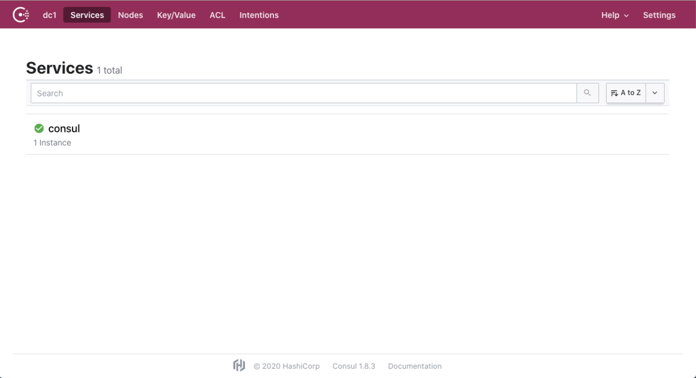
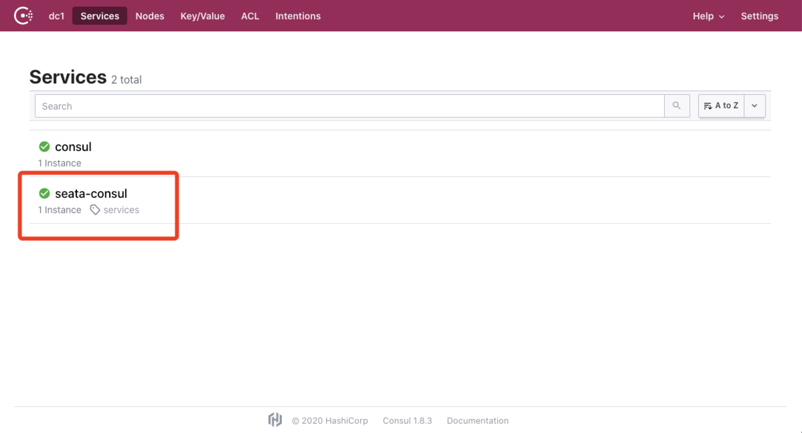
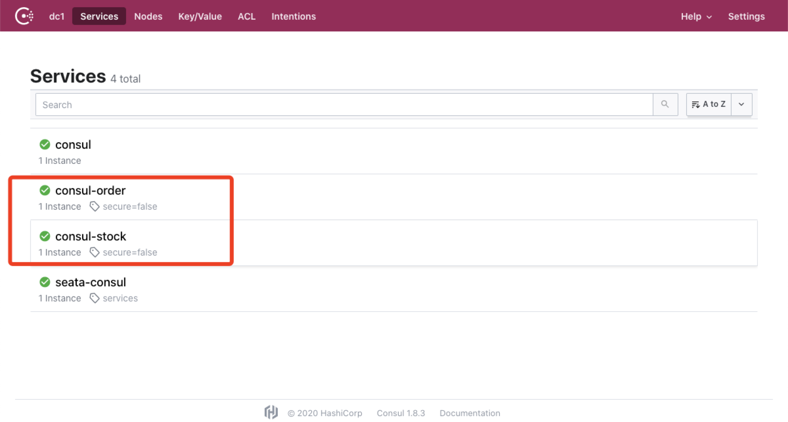

# Seata实践二（consul）

本文介绍基于 SpringCloud、Mybatis-Plus、consul 集成 Seata 1.4.0 的示例。


<!-- more -->

## 准备工作 

### consul安装

- 下载地址 [https://www.consul.io/downloads.html](https://www.consul.io/downloads.html)，根据系统选择对应的版本下载即可
- 解压下载的压缩包，可得到一个名为 consul 的可执行文件 
- 执行命令 `consul agent -dev` 即可启动 consul
- 访问 http://localhost:8500/ 如能看下如下界面，则代表 consul 启动成功



### seata使用

seata的安装详见 [Seata实践一（nacos）](/pages/611192/)，本文不再赘述。区别于使用 nacos 注册中心和配置中心，集成consul仅用consul作为注册中心，配置才用文件的方式。如有需要使用 consul 作为配置中心，可参照集成 nacos 的讲解。

- 修改 /seata/conf 目录下的 registry.conf 文件，内容如下：

  ```properties
  registry {
    # file 、nacos 、eureka、redis、zk、consul、etcd3、sofa
    type = "consul"
    loadBalance = "RandomLoadBalance"
    loadBalanceVirtualNodes = 10
  
    consul {
      cluster = "seata-consul"
      serverAddr = "127.0.0.1:8500"
    }
  }
  
  config {
    # file、nacos 、apollo、zk、consul、etcd3
    type = "file"
    file {
      name = "file.conf"
    }
  }

  ```
  可以看到，配置中指定了注册中心为 consul ，配置中心为 file 类型，具体即同级目录下的 file.conf 文件。
  
 - file 配置
   在 [Seata实践一（nacos）](/pages/611192/) 一文中，由于配置中心使用 nacos ，没有对file文件做说明。实际上，seata 下载解压后就存在 registry.conf 和 file.conf ，当我们使用 file 类型作为配置中心时，仅需改动 file.conf 下的 store节点。
   
   ```properties
    store {
      ## store mode: file、db、redis
      mode = "db"
    
      ## database store property
      db {
        ## the implement of javax.sql.DataSource, such as DruidDataSource(druid)/BasicDataSource(dbcp)/HikariDataSource(hikari) etc.
        datasource = "druid"
        ## mysql/oracle/postgresql/h2/oceanbase etc.
        dbType = "mysql"
        driverClassName = "com.mysql.jdbc.Driver"
        url = "jdbc:mysql://localhost:3306/seata"
        user = "root"
        password = "123456"
        minConn = 5
        maxConn = 30
        globalTable = "global_table"
        branchTable = "branch_table"
        lockTable = "lock_table"
        queryLimit = 100
      }
    }
   
   ```
   store 节点指定存储模式为 db ，并且在db节点中制定数据库连接配置即可。
   
   完成上述操作后，启动 seata，去 consul UI 界面中，能看到 seata 已经注册到 consul 上。
   
   可以看到服务列表中增加了 seata-consul 服务。
  
  
## 创建工程

### 目录结构

本文以 consul 为注册中心和配置中心，所以对应项目放在 consul 目录下：

```
   |--seata-study
   
   |----consul
   
   |------consul-order
   
   |------consul-stock
 ```

### pom 依赖

pom 依赖大体上和 nacos 的配置区别不大，主要是将 nacos 替换为 consul，即：
```xml
    <!-- nacos -->
    <!-- <dependency>
         <groupId>com.alibaba.cloud</groupId>
         <artifactId>spring-cloud-starter-alibaba-nacos-discovery</artifactId>
         <version>2.2.0.RELEASE</version>
    </dependency>-->
    
    <!-- consul -->
    <dependency>
        <groupId>org.springframework.cloud</groupId>
        <artifactId>spring-cloud-starter-consul-discovery</artifactId>
    </dependency>
```

### 项目配置

以 consul-order 为例，consul-stock修改对应数据库参数、server端口、应用名即可。application.yml完整内容如下：
```yaml
server:
  port: 30001

spring:
  application:
    name: consul-order
  datasource:
    druid:
      filters: stat
      driver-class-name: com.mysql.jdbc.Driver
      #基本属性
      url: jdbc:mysql://localhost:3306/seata-order?useUnicode=true&characterEncoding=UTF-8&allowMultiQueries=true
      username: root
      password: 123456
      #配置初始化大小/最小/最大
      initial-size: 1
      min-idle: 1
      max-active: 20
      #获取连接等待超时时间
      max-wait: 60000
      #间隔多久进行一次检测，检测需要关闭的空闲连接
      time-between-eviction-runs-millis: 60000
      #一个连接在池中最小生存的时间
      min-evictable-idle-time-millis: 300000
      validation-query: SELECT 'x'
      test-while-idle: true
      test-on-borrow: false
      test-on-return: false
      #打开PSCache，并指定每个连接上PSCache的大小。oracle设为true，mysql设为false。分库分表较多推荐设置为false
      pool-prepared-statements: false
      max-pool-prepared-statement-per-connection-size: 20
  cloud:
    consul:
      discovery:
        service-name: ${spring.application.name}
        heartbeat:
          enabled: true #默认为false 不改为true则有可能导致服务正常启动且注册到consul，但健康检查失败，从而无法实现微服务调用
      host: localhost
      port: 8500


seata:
  enabled: true
  application-id: seata-${spring.application.name}
  tx-service-group: seata-server-group
  #  enable-auto-data-source-proxy: true
  enableAutoDataSourceProxy: true
  transport:
    # tcp, unix-domain-socket
    type: tcp
    #NIO, NATIVE
    server: nio
    #enable heartbeat
    heartbeat: true
    # the client batch send request enable
    enable-client-batch-send-request: false
    #thread factory for netty
    thread-factory:
      boss-thread-prefix: NettyBoss
      worker-thread-prefix: NettyServerNIOWorker
      server-executor-thread-prefix: NettyServerBizHandler
      share-boss-worker: false
      client-selector-thread-prefix: NettyClientSelector
      client-selector-thread-size: 1
      client-worker-thread-prefix: NettyClientWorkerThread
      # netty boss thread size
      boss-thread-size: 1
      #auto default pin or 8
      worker-thread-size: default
    # when destroy server, wait seconds
    shutdown:
      wait: 3
    serialization: seata
    compressor: none
  service:
    vgroup-mapping:
      seata-server-group: default
    grouplist:
      default: 127.0.0.1:8091
    enable-degrade: true
    disable-global-transaction: false

mybatis-plus:
  configuration:
    # 这个配置会将执行的sql打印出来，在开发或测试的时候可以用
    log-impl: org.apache.ibatis.logging.stdout.StdOutImpl

log:
  exception-rate: 100


```
其他的代码编写和 nacos 案例基本上一致，如有需要可访问底部源码直通车查看。

### 部署应用
分别启动 consul-order 和 consul-stock ，访问 consul UI 能看到所有注册成功服务，如图：

至此基本上就完成了所有准备工作，验证部分就不写了，和 nacos 案例一致，代码也可服用。

### 源码

[](https://gitee.com/zjoin/seata-study/stargazers) [](https://gitee.com/zjoin/seata-study/members)


