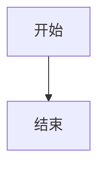
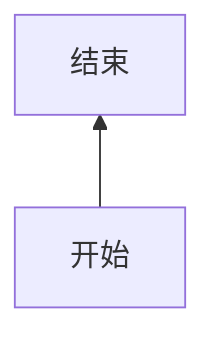
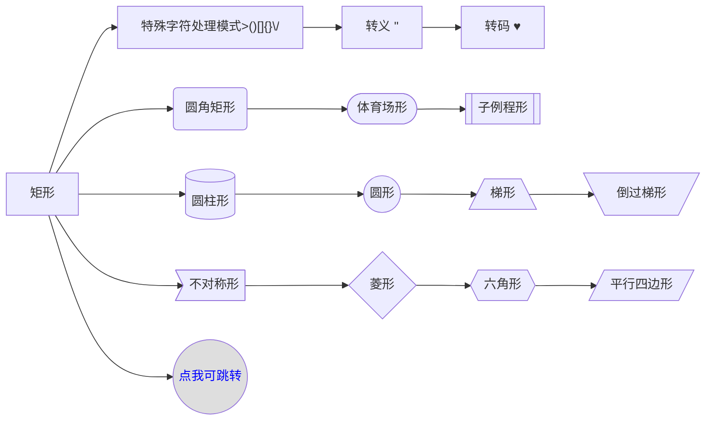
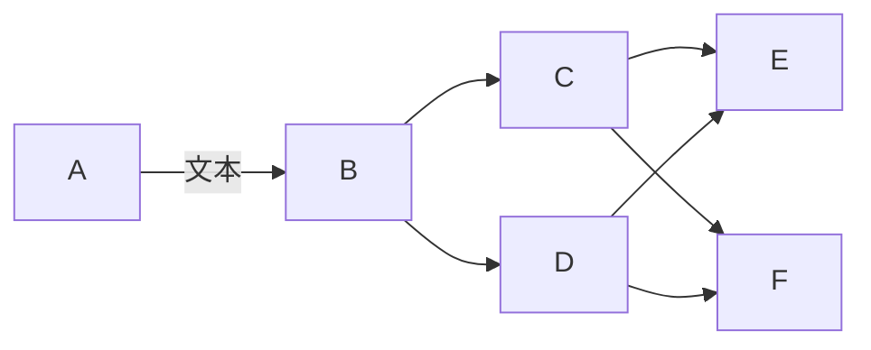
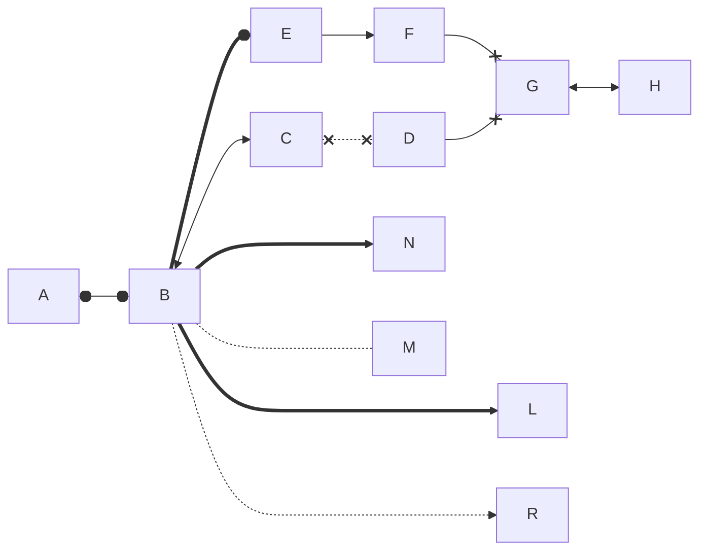
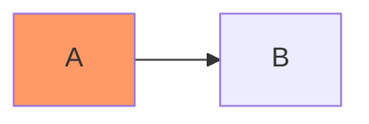
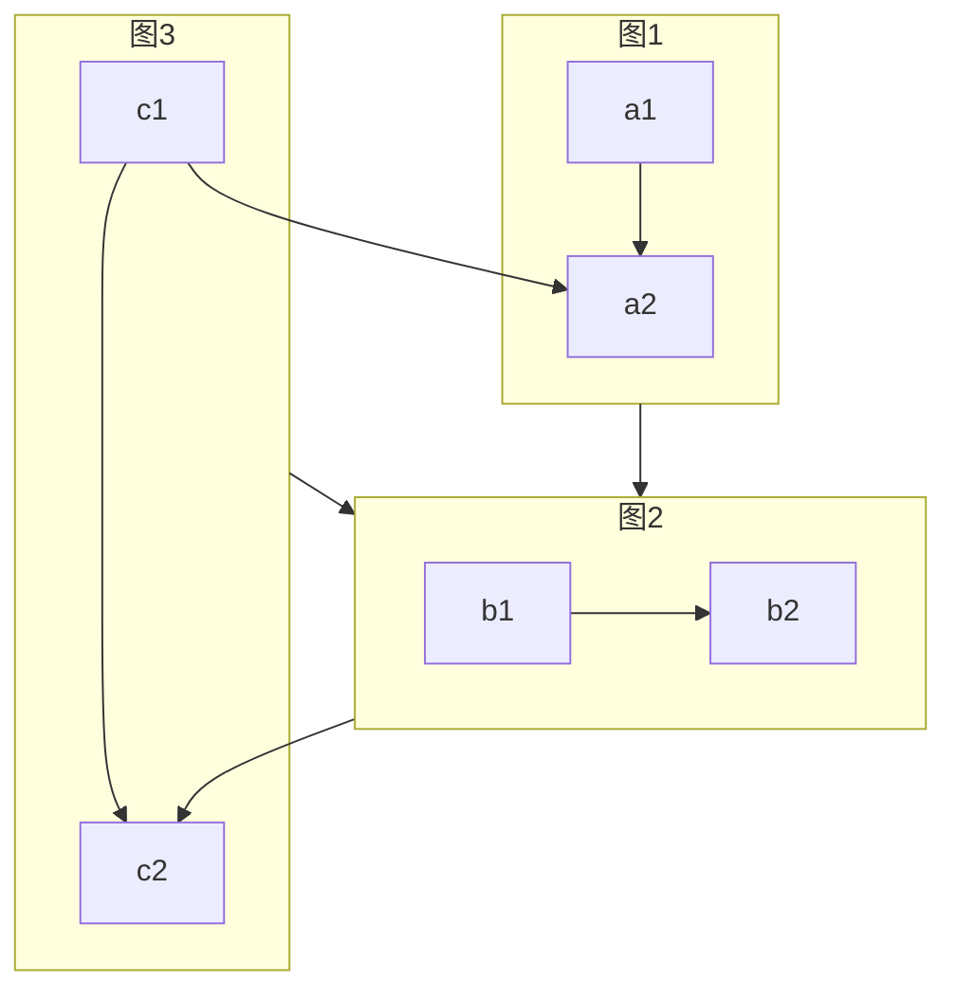

# mermaid 语法之流程图

Mermaid 是一个用于画流程图、状态图、时序图、甘特图的库，使用 JS 进行本地渲染，广泛集成于许多 Markdown 编辑器中。
Mermaid 的使用语法，在Markdown中和其他代码一致，只需申明是 mermaid 即可。

<!-- more -->

## 流程图方向
### TB：从上到下
::: details
graph TB
    开始 --> 结束
:::

### TD：自顶向下/从上至下相同
::: details
graph TD
    开始 --> 结束

:::
### BT：从下到上
::: details
graph BT
    开始 --> 结束

:::
### RL：从右到左
::: details
graph RL
    开始 --> 结束

:::

### LR：从左到右
::: details
graph LR
    开始 --> 结束

:::

## 节点、形状和文本处理

::: details

graph LR

    id1[矩形] --> id0["特殊字符处理模式>()[]{}\/"] -->id11["转义 #quot;"] -->id12["转码 #9829;"] 
    id1[矩形] --> id2(圆角矩形) --> id3([体育场形]) --> id4[[子例程形]]
    id1[矩形] --> id5[(圆柱形)] --> id6((圆形)) -->  A[/梯形\] --> B[\梯形/]
    id1[矩形] --> id7>标签形] --> id8{菱形} --> id9{{六角形}} --> id10[/平行四边形/] 

    style id15 fill:#dedede,color:blue
    click id15 "https://www.studying.icu/" "Open this in a new tab" _blank
:::

## 节点连接样式
- 如果申明为 `graph` ，只支持单一类型的链接，即 带箭头 和 不带箭头。
::: details
graph LR
A -- 文本 -->B -->C & D --> E & F
:::

- 如果申明为 `flowchart` ,则可以有风丰富的形态。
::: details
flowchart LR
  
    A o--o B ==o E -->F --xG<-->H
    B <--> C x-.-x D --xG
    B ===> N
    B -..- M
    B ====> L
    B -...-> R
:::

**`注意看线条类型的不同以及长度，两种图模式都适用。`**

## 样式

### 节点内定义
:::details
graph LR
    id1(Start)-->id2(Stop)
    style id1 fill:#f9f,stroke:#333,stroke-width:4px
    style id2 fill:#bbf,stroke:#f66,stroke-width:2px,color:#fff,stroke-dasharray: 5 5
:::

### 添加样式到节点

:::details
graph LR
    A:::someclass --> B
    classDef someclass fill:#f96;
:::

## 子图
