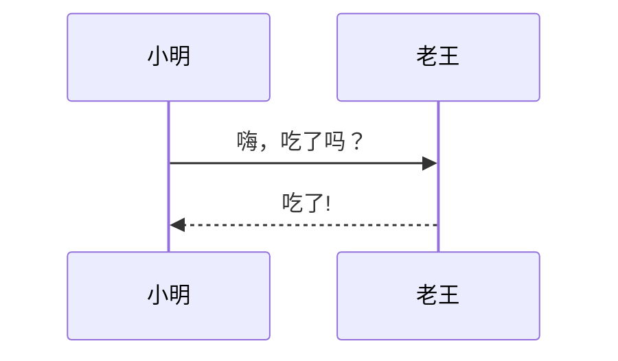
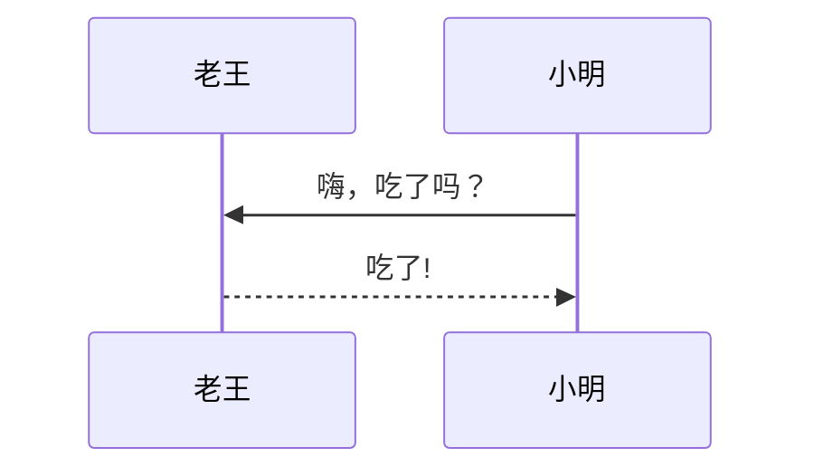
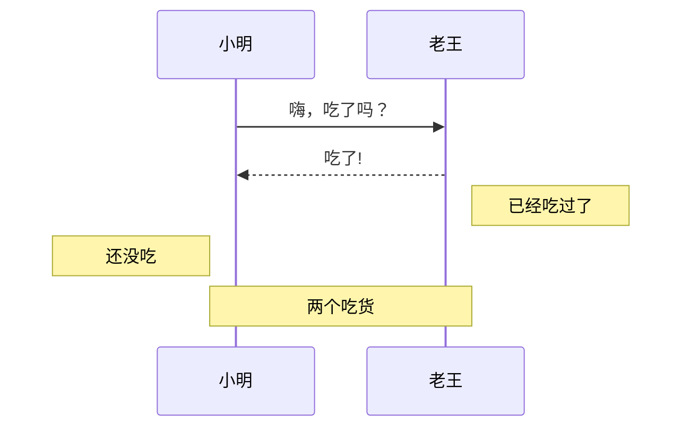
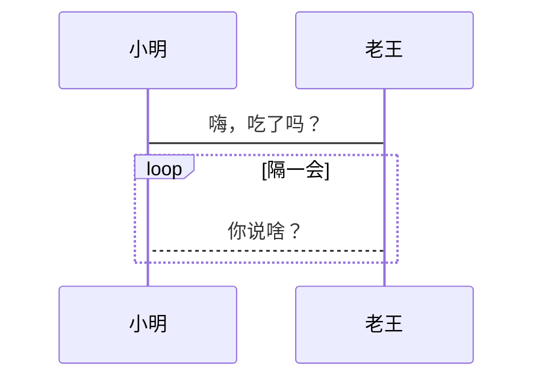
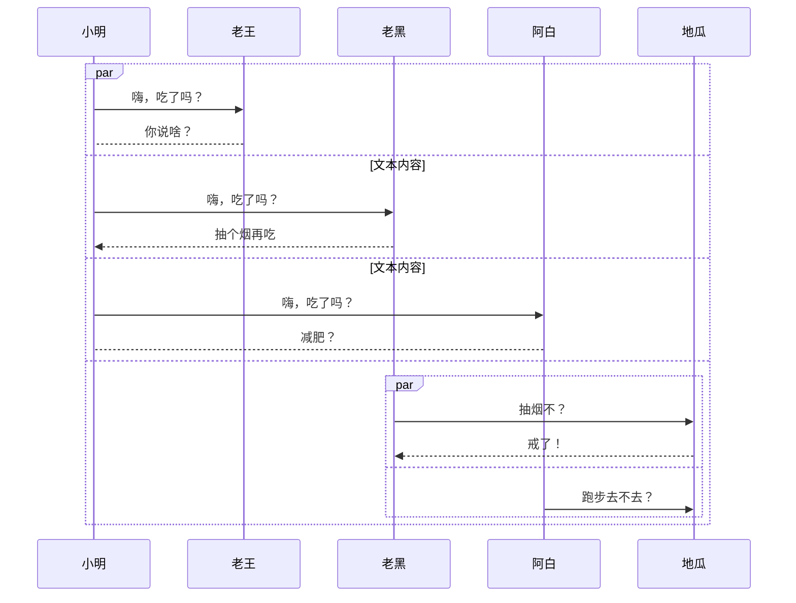
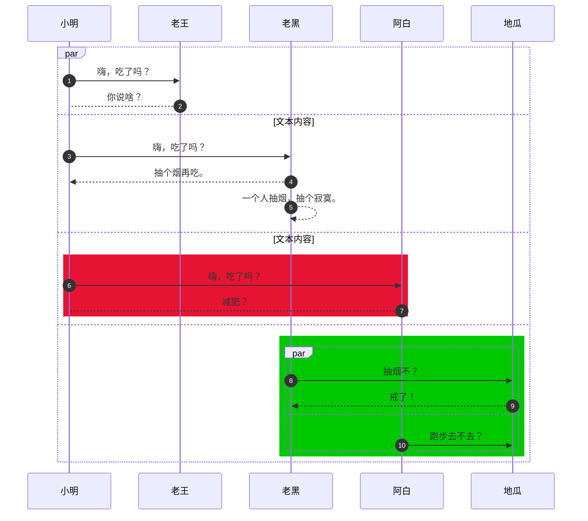

# mermaid 语法之序列图

Mermaid 是一个用于画流程图、状态图、时序图、甘特图的库，使用 JS 进行本地渲染，广泛集成于许多 Markdown 编辑器中。
Mermaid 的使用语法，在Markdown中和其他代码一致，只需申明是 mermaid 即可。

<!-- more -->

序列图需要在第一行定义图类型为 **`sequenceDiagram`**。一个简单示例如下：

## 语法

### 参与者和别名

**`participant`** 关键字 用于定义参与者，参与者有两个用法。

- `调整出厂顺序`：比如上述例子，换成老王在第一列，但还是小明像老王打招呼。
:::details
sequenceDiagram
  
    participant 老王
    participant 小明
    小明->>老王: 嗨，吃了吗？
    老王-->>小明: 吃了!
:::

- `定义别名`

:::details
sequenceDiagram
  
    participant a as 小明
    participant b as 老王
    a->>b: 嗨，吃了吗？
    b-->>a: 吃了!
:::

### 箭头类型

| 类型 |	描述|
| :-----| :----: |
|->	|实线无箭头|
|->	|虚线无箭头|
|->>|	带箭头的实线|
|-->>|	带箭头的虚线|
|-X	|实线，末端带有叉号（异步）|
|- X|	虚线末端带有叉号（异步）|

### 文本说明

上述例子中，箭头上已经携带了留言，但有时候我们想添加额外的说明，有单个也，也有跨列的，详见示例

:::details
sequenceDiagram

    小明->>老王: 嗨，吃了吗？
    老王-->>小明: 吃了!
    Note right of 老王: 已经吃过了
    Note left of 小明: 还没吃
    Note over 小明,老王: 两个吃货
:::

### 循环

如果老王耳朵不好，小明脑子不好，两个人的对话可能陷入死循环
:::details
sequenceDiagram

    小明->老王: 嗨，吃了吗？
    loop 隔一会
        老王-->小明: 你说啥？
    end
:::

### 多列和嵌套

:::details

sequenceDiagram

    par
    小明->>老王: 嗨，吃了吗？
    老王-->小明: 你说啥？
    and 文本内容
    小明->>老黑: 嗨，吃了吗？
    老黑-->>小明: 抽个烟再吃
    
    and 文本内容
    小明->>阿白: 嗨，吃了吗？
    阿白-->小明: 减肥？
    
    and
        par
        老黑->>地瓜: 抽烟不？
        地瓜-->>老黑: 戒了！
        and
        阿白->>地瓜: 跑步去不去？
        end
    end
:::

### 背景和编号
:::details
sequenceDiagram

    par
    小明->>老王: 嗨，吃了吗？
    老王-->小明: 你说啥？
    and 文本内容
    小明->>老黑: 嗨，吃了吗？
    老黑-->>小明: 抽个烟再吃
    and 文本内容
        rect rgb(230, 20, 50)
        小明->>阿白: 嗨，吃了吗？
        阿白-->小明: 减肥？
        end
    and
        rect rgb(0, 200, 0)
            par
            老黑->>地瓜: 抽烟不？
            地瓜-->>老黑: 戒了！
            and
            阿白->>地瓜: 跑步去不去？
            end
        end
    end
:::

`注意： autonumber 加上该字段后，实现了自动编号`